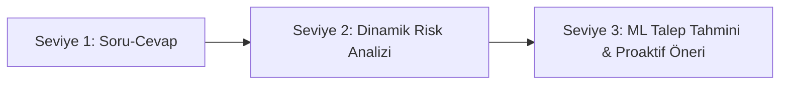
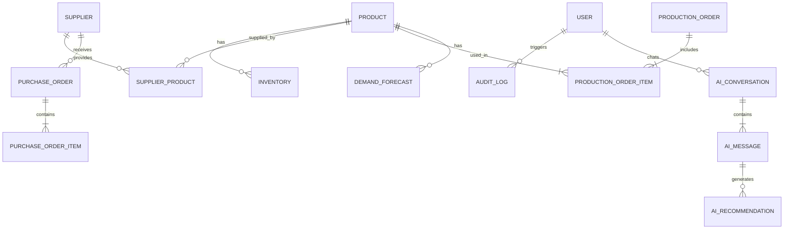

# 🚀 AI-Powered Next-Gen ERP System

<div align="center">


<p align="center">
  <b>Clean Architecture</b> ve <b>CQRS</b> prensipleriyle geliştirilmiş; yapay zeka destekli proaktif karar mekanizmalarına (AI Copilot) ve makine öğrenimi tabanlı talep tahminleme motoruna sahip kurumsal kaynak planlama (ERP) platformu.
</p>

[📌 Proje Özeti](#-proje-özeti) •
[✨ Temel Özellikler](#-temel-özellikler) •
[🧠 AI Copilot & ML](#-ai-copilot--ml-motoru) •
[🏗️ Mimari Tasarım](#️-sistem-mimarisi) •
[📦 Modüller](#-modüller-ve-veri-modeli) •
[🛠️ Kurulum](#️-kurulum-ve-başlatma) •
[📈 Yol Haritası](#-geliştirme-yol-haritası)

---

</div>

## 📌 Proje Özeti

Bu proje; klasik ERP süreçlerini (Stok, Satın Alma, Üretim, Tedarikçi ve Satış) modern **Clean Architecture** prensipleriyle yönetirken, sisteme entegre **AI Copilot** ve **Python Makine Öğrenimi (ML)** servisleri ile geleneksel reaktif yönetim anlayışını proaktif bir karar destek sistemine dönüştürür.

### Neden Bu Proje?
* **Akıllı & Proaktif Karar Desteği:** Kritik stok veya tedarikçi gecikmesi gibi riskleri henüz gerçekleşmeden tespit eder ve aksiyon önerir.
* **Güvenli AI Mimarisi (Tool Calling):** Yapay zeka doğrudan veritabanına sorgu atmaz; kontrollü ERP API fonksiyonları üzerinden yetkili veriyi işler.
* **İnsan Onaylı Eylemler (Human-in-the-Loop):** AI asla kendi başına sipariş açmaz; önerir, yönetici onaylar, ERP işleme alır.
* **Yüksek Performans & Ölçeklenebilirlik:** CQRS (MediatR), Redis önbellekleme ve Docker konteynerizasyonu ile kurumsal seviyede performans.

---

## ✨ Temel Özellikler

| Alan | Kabiliyetler |
| :--- | :--- |
| 🛡️ **Kimlik & Yetki (IAM)** | JWT & Refresh Token, Rol Tabanlı Erişim Kontrolü (RBAC - Admin, Manager, Employee), Audit Loglama |
| 📦 **Stok & Ürün Yönetimi** | Çoklu depo takibi, birim & kategori yönetimi, dinamik kritik stok eşikleri ve hareket geçmişi |
| 🚚 **Tedarikçi & Satın Alma** | Fiyat matrisleri, tedarikçi teslimat performansı analizi, onay akışlı satın alma talepleri |
| ⚙️ **Üretim Yönetimi** | Üretim emirleri (BOM - Reçete), malzeme tüketim takibi, reçete maliyetlendirme ve durum izleme |
| 🤖 **AI ERP Copilot** | Doğal dil ile ERP veri sorgulama, özetleme ve sohbet tabanlı aksiyon tetikleme (Tool Calling) |
| 📈 **ML Tabanlı Tahminleme** | Python FastAPI servisi ile geçmiş verilerden hareketle talep tahmini (Demand Forecasting) |
| 📊 **Modern Dashboard** | Gerçek zamanlı grafikler, KPI sayaçları, anlık uyarı akışları ve AI asistan paneli |

---

## 🧠 AI Copilot & ML Motoru

Sistemin kalbinde, ERP verileriyle zenginleştirilmiş güvenli bir yapay zeka ekosistemi yer alır.

```
 Kullanıcı (Doğal Dil)
         │
         ▼
 ┌───────────────┐        Tool Call (JSON)        ┌─────────────────┐
 │   AI Copilot  │ ─────────────────────────────► │   ERP Core API  │
 └───────────────┘                                └─────────────────┘
         ▲                                                 │
         │             Yetkili & Güvenli Veri              ▼
         └─────────────────────────────────────── ┌─────────────────┐
                                                  │   SQL Database  │
                                                  └─────────────────┘
```

### 1. Güvenli Tool / Function Calling Mimarisi
AI doğrudan SQL çalıştırmaz. Sadece tanımlı ve yetkilendirilmiş API araçlarını çağırabilir:
* `get_low_stock_products()`
* `get_product_stock(productId)`
* `get_pending_purchase_orders()`
* `get_production_orders()`
* `get_supplier_delivery_performance(supplierId)`

### 2. AI Yetenek Seviyeleri



* **Seviye 1 (Soru-Cevap):** *"En az stoğa sahip 5 ürün hangisi?"*, *"Bu ay onay bekleyen satın almalar neler?"*
* **Seviye 2 (Analiz):** *"Önümüzdeki 30 günde tükenme riski olan ürünleri ve tedarikçi gecikmelerini listele."*
* **Seviye 3 (ML & Proaktif Öneri):** 
  > ⚠️ **Proaktif Bildirim:**  
  > `PRD-102` ürününün tahmini tüketim hızına göre **8 gün içinde** kritik stok seviyesinin altına düşeceği öngörülmektedir.  
  > **Önerilen Aksiyon:** En uygun tedarikçiden **250 adet Satın Alma Siparişi** oluşturulması.  
  > `[ ✅ Siparişi Onayla ve Oluştur ]` *(Human-in-the-loop)*

---

## 🏗️ Sistem Mimarisi

Sistem, sorumlulukların net ayrıldığı çok katmanlı mikroservis/modüler monolit mimariyi benimser:

```
                      ┌───────────────────────────┐
                      │   Angular SPA (Frontend)  │
                      └─────────────┬─────────────┘
                                    │ HTTPS / REST
                                    ▼
                      ┌───────────────────────────┐
                      │   ASP.NET Core Web API    │
                      │  (Gateway & Business Core)│
                      └──────┬─────────────┬──────┘
                             │             │
              ┌──────────────┘             └──────────────┐
              ▼                                           ▼
   ┌────────────────────┐                       ┌────────────────────┐
   │  MSSQL Server DB   │                       │  Python AI Engine  │
   │  & Redis Cache     │                       │ (FastAPI + ML)     │
   └────────────────────┘                       └────────────────────┘
```

### 🧱 Clean Architecture Katman Yapısı

```
src/
├── 📁 Domain                     # Kurumsal İş Mantığı & Saf Modeller
│   ├── Entities                 # Product, Inventory, PurchaseOrder, AIRecommendation vb.
│   ├── ValueObjects             # Money, Address, Dimension vb.
│   ├── Enums                    # OrderStatus, Priority, UserRole vb.
│   └── Interfaces               # Temel Repository & UnitOfWork sözleşmeleri
│
├── 📁 Application                # Uygulama Mantığı & CQRS Komutları
│   ├── Features/                # Modül bazlı Command, Query ve Handler'lar (MediatR)
│   │   ├── Products/
│   │   ├── Inventory/
│   │   ├── Purchasing/
│   │   ├── Production/
│   │   └── AI/
│   ├── DTOs/                    # Veri Transfer Nesneleri
│   ├── Behaviors/               # Validation, Logging & Performance Pipeline'ları
│   └── Validators/              # FluentValidation kuralları
│
├── 📁 Infrastructure             # Dış Sistem Entegrasyonları & Veri Erişimi
│   ├── Persistence/             # EF Core DbContext, Migrations, Mapping
│   ├── Identity/                # JWT Token Üretimi, Refresh Token & Hashleme
│   ├── AI/                      # LLM API İstemcileri, Tool Executor
│   └── Services/                # Email, Background Jobs, Cache Services
│
└── 📁 API                        # Sunum Katmanı
    ├── Controllers/             # RESTful API Endpoint'leri
    ├── Middleware/              # Global Exception Handling, Auth Middleware
    └── Extensions/              # Service Registration & Swagger Config
```

---

## 📦 Modüller ve Veri Modeli



### 🗄️ Başlıca Varlıklar (Entities)
* **Auth & IAM:** `User`, `Role`, `UserRole`, `AuditLog`
* **Ürün & Envanter:** `Product`, `Category`, `Unit`, `Warehouse`, `Inventory`, `InventoryTransaction`
* **Satın Alma & Tedarik:** `Supplier`, `SupplierProduct`, `PurchaseOrder`, `PurchaseOrderItem`
* **Üretim:** `ProductionOrder`, `ProductionOrderItem`, `BillOfMaterials`
* **Satış:** `Customer`, `SalesOrder`, `SalesOrderItem`
* **Yapay Zeka & Tahmin:** `AIConversation`, `AIMessage`, `AIAction`, `AIRecommendation`, `DemandForecast`

---

## 💻 Teknoloji Yığını

| Katman | Teknoloji / Kütüphane | Kullanım Amacı |
| :--- | :--- | :--- |
| **Backend Core** | C# .NET 8 / 9, ASP.NET Core Web API | Ana iş motoru ve kurumsal RESTful servisler |
| **Mimari Yaklaşım** | Clean Architecture, CQRS, MediatR | Bağımsız, test edilebilir ve sürdürülebilir mimari |
| **ORM & Veritabanı** | Entity Framework Core, MS SQL Server / PostgreSQL | Veri modelleme, migration ve sorgu yönetimi |
| **Doğrulama & Güvenlik**| FluentValidation, JWT, BCrypt, Rate Limiting | Veri bütünlüğü, kimlik doğrulama ve API güvenliği |
| **Loglama & İzleme** | Serilog, Seq / Elasticsearch | Yapılandırılmış loglama ve denetim kayıtları |
| **Frontend** | Angular 17+, TypeScript, RxJS, Tailwind/SCSS | Hızlı, reaktif ve modern kullanıcı arayüzü |
| **AI & ML Engine** | Python, FastAPI, Scikit-Learn, XGBoost, Pandas | Talep tahminleme (Demand Forecast) ve analitik servisler |
| **Önbellek (Cache)** | Redis | Sık erişilen ürün ve oturum verilerini önbellekleme |
| **DevOps & Dağıtım** | Docker, Docker Compose | Tek komutla ayağa kaldırılabilen konteyner yapısı |

---

## 🛠️ Kurulum ve Başlatma

### 📋 Ön Koşullar
* [.NET 8+ SDK](https://dotnet.microsoft.com/download)
* [Node.js (v18+)](https://nodejs.org/) & [Angular CLI](https://angular.io/cli)
* [Python 3.10+](https://www.python.org/)
* [Docker Desktop](https://www.docker.com/)

---

### 🐳 1. Docker ile Hızlı Başlatma (Önerilen)

Tüm sistemi (Frontend, Backend, AI Servisi, Veritabanı ve Redis) tek bir komutla ayağa kaldırabilirsiniz:

```bash
# Projeyi klonlayın
git clone https://github.com/kullaniciadi/ERP_Projesi.git
cd ERP_Projesi

# Konteynerleri derleyin ve başlatın
docker compose up -d --build
```

Servisler hazır olduğunda:
* 🌐 **Frontend (Angular):** `http://localhost:4200`
* 🔌 **Backend API (Swagger):** `http://localhost:5000/swagger`
* 🤖 **AI FastAPI Servisi:** `http://localhost:8000/docs`

---

### 💻 2. Manuel / Geliştirici Ortamı Kurulumu

<details>
<summary><b>Detaylı geliştirici kurulum adımları için tıklayın</b></summary>

#### A. Backend (.NET Core)
```bash
cd src/API
dotnet restore
dotnet ef database update --project ../Infrastructure
dotnet run
```

#### B. AI & Tahminleme Servisi (Python FastAPI)
```bash
cd ai-service
python -m venv venv
# Windows:
venv\Scripts\activate
# Linux/macOS:
source venv/bin/activate

pip install -r requirements.txt
uvicorn main:app --reload --port 8000
```

#### C. Frontend (Angular)
```bash
cd frontend
npm install
ng serve
```

</details>

---

## 📈 Geliştirme Yol Haritası

- [x] **Phase 1 — Mimari Temeller:** Çözüm tasarımı, Clean Architecture şablonu, Git stratejisi.
- [ ] **Phase 2 — Kimlik Doğrulama:** Identity, JWT, Refresh Token ve RBAC kurgusu.
- [ ] **Phase 3 — Çekirdek ERP:** Ürün, Kategori, Depo, Stok ve Tedarikçi CRUD akışları.
- [ ] **Phase 4 — İş Süreçleri:** Satın Alma ve Üretim emirleri, Reçete (BOM) yönetimi.
- [ ] **Phase 5 — Modern Frontend:** Angular arayüzü, Dashboard grafikleri ve form yönetimi.
- [ ] **Phase 6 — AI Copilot Entegrasyonu:** LLM Tool Calling mekanizması ve sohbet arayüzü.
- [ ] **Phase 7 — Makine Öğrenimi:** FastAPI talep tahminleme motoru (Scikit-Learn/XGBoost).
- [ ] **Phase 8 — Dağıtım & Prod:** Docker Compose, Redis cacheleme, CI/CD pipeline.

---

## 🧪 Test Stratejisi

Projede güvenilirlik ve veri bütünlüğü için çok katmanlı test yaklaşımı uygulanmaktadır:

```bash
# Backend Testlerini Çalıştır
dotnet test --logger "console;verbosity=detailed"
```

* **Birim Testleri (Unit Tests):** `ProductService`, `InventoryService`, `PurchaseOrderService` ve Domain iş kuralları doğrulaması.
* **Entegrasyon Testleri:** API Controller katmanından veritabanına ve AI servisine olan uçtan uca akışlar.
* **Hedef:** Kritik iş kurallarında en az **%70+ kod kapsamı (code coverage)**.

---

## 🔒 Güvenlik & Denetim (Audit)

* 🔑 **Güvenli İletişim:** Tüm hassas isteklerde JWT Bearer doğrulaması.
* 🛡️ **SQL Injection & XSS Koruması:** EF Core parametrik sorguları ve güçlü girdi doğrulama (FluentValidation).
* 📝 **AI İşlem Denetimi:** AI tarafından önerilip kullanıcı tarafından onaylanan tüm operasyonlar (`WAITING_FOR_APPROVAL` ➔ `APPROVED` ➔ `EXECUTED`) veritabanında ayrıntılı şekilde loglanır.

---

## 🤝 Katkıda Bulunma

1. Bu depoyu Fork'layın (`fork`)
2. Yeni özellik dalı açın (`git checkout -b feature/YeniOzellik`)
3. Değişikliklerinizi kaydedin (`git commit -m 'feat: Yeni özellik eklendi'`)
4. Dalınıza push yapın (`git push origin feature/YeniOzellik`)
5. Bir **Pull Request** oluşturun

---

## 📄 Lisans

Bu proje [MIT Lisansı](LICENSE) kapsamında lisanslanmıştır.